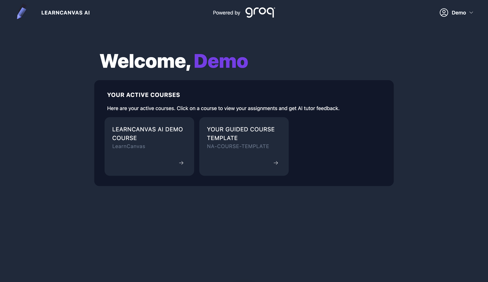

# LearnCanvas AI

A fullstack web application that uses Generative AI and Canvas LMS API to provide tutoring and feedback on students' assignments and submissions.

**Video Demo:** https://youtu.be/1NmYPafCBRQ

**Demo Website:** [https://learncanvas-ai.vercel.app](https://learncanvas-ai.vercel.app)

You can login the website using these demo user's credentials.

**Username:** alohademo123@gmail.com

**Password:** aloha@123
